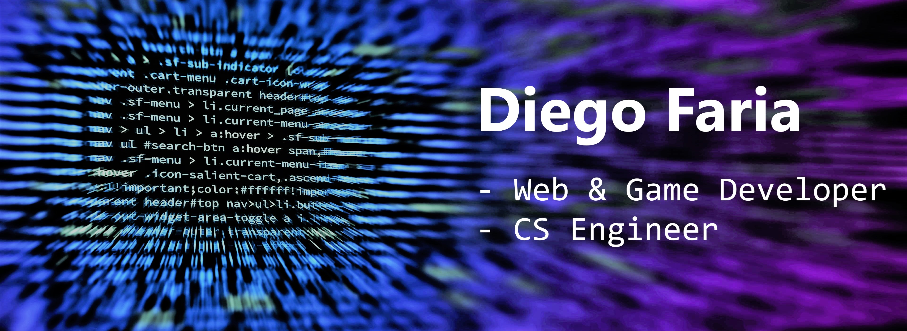
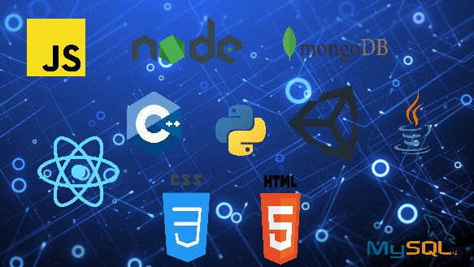

# Welcome to my profile!

## About me

Hi there! I am Diego Faria, a student of Computer Science Engineering who is acquiring knowledge of topics such as web development, game development and programming in general.
Why? Well, because technology and learning are two of my greatest passions!

You are welcome to see my repositories and ask me whatever you want!

## Abilities

My projects are written mainly in the technologies you can see here:

Anyway, I am so curious that I know a little bit of a lot of things! 

## Languages

I am proficient in Spanish and English. However, I also know a bit of French and Japanese.
